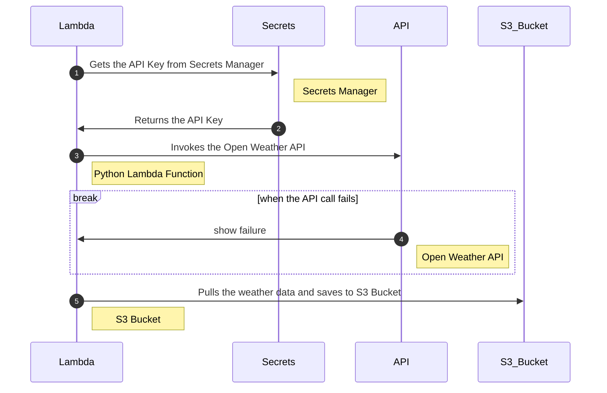
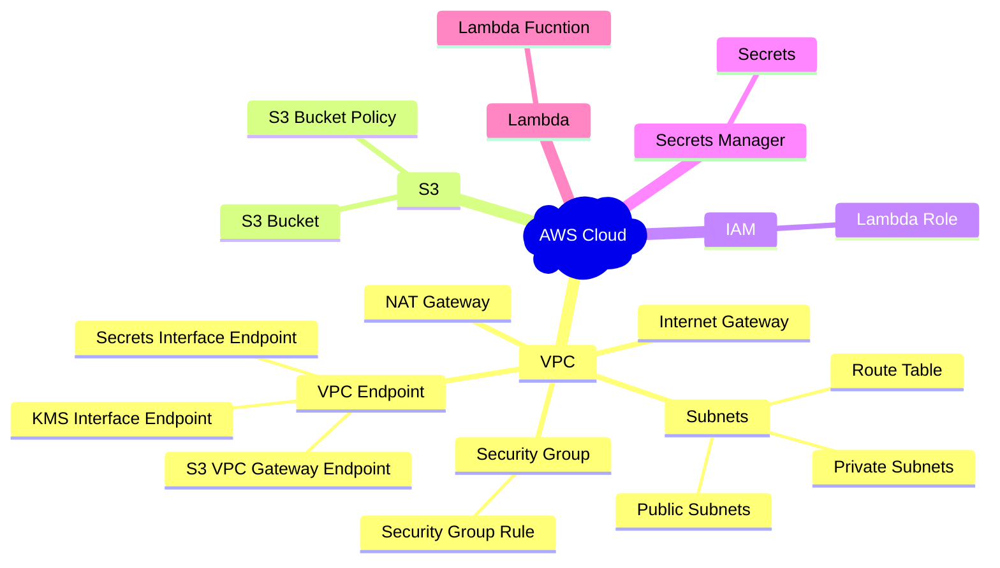
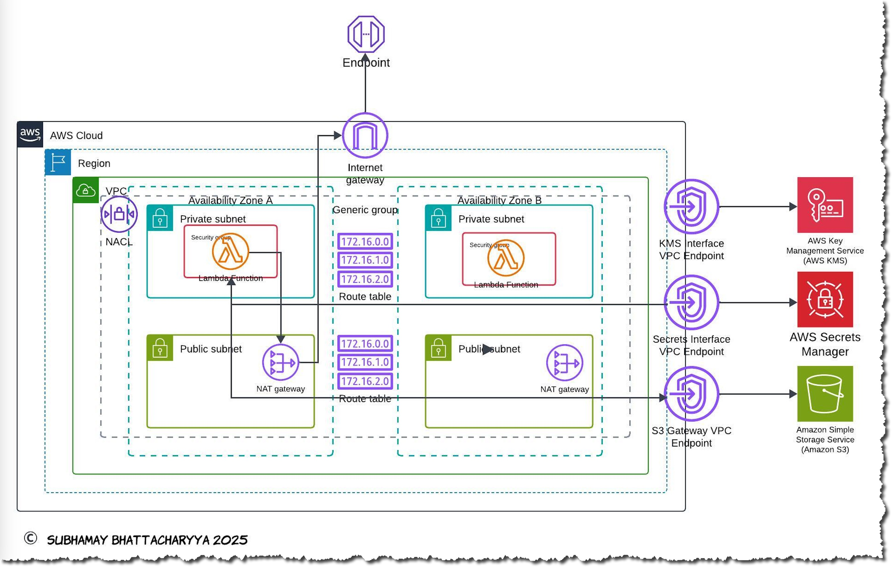

&nbsp;&nbsp;&nbsp;&nbsp;&nbsp;&nbsp;&nbsp;&nbsp;&nbsp;


# DevOps 30 Day Challange - Week 1, Day 01: Weather Dashboard using Python Lambda, S3, Secrets Manager and CloudFormation

[](https://aws.amazon.com/)
Brief description of the project. Explain what it does and its primary purpose.



---

## Table of Contents

- [About the Project](#about-the-project)
    - [Workflow Steps](#workflow-steps)
    - [Key AWS services used](#key-aws-services-used)
- [Architecture](#architecture)
- [Getting Started](#getting-started)
  - [Prerequisites](#prerequisites)
  - [Installation](#installation)
- [Deployment](#deployment)
- [Configuration](#configuration)
- [Contributing](#contributing)
- [License](#license)
    - [Code of Conduct](#code-of-conduct)
- [Contact](#contact)

---

## About the Project

The project involves an AWS Lambda function that orchestrates the retrieval and processing of data from external APIs while securely managing API credentials. The processed data is stored in an S3 bucket for further usage or analysis.

### Workflow Steps
The image depicts a sequence diagram illustrating the flow of a serverless workflow that integrates AWS Lambda, Secrets Manager, APIs, and an S3 Bucket. Below is a detailed description of the project based on the diagram:

### Project Overview
The project involves an AWS Lambda function that orchestrates the retrieval and processing of data from external APIs while securely managing API credentials. The processed data is stored in an S3 bucket for further usage or analysis.

### Workflow Steps

1. **Retrieve API Key**:
   - The Lambda function initiates the process by requesting the API key from AWS Secrets Manager.
   - Secrets Manager securely stores and provides the required API key to the Lambda function.

2. **API Key Delivery**:
   - The Secrets Manager returns the API key to the Lambda function.

3. **API Invocation**:
   - The Lambda function uses the retrieved API key to invoke an external API (labeled as the Open Weather API in the diagram).
   - If the Open Weather API call is successful, the Lambda function processes the data.

4. **Error Handling**:
   - In the event of an API call failure, the Lambda function switches to an alternative data source, the OpenWeather API.
   - The failure is logged or reported, ensuring visibility into the issue.

5. **Data Storage**:
   - After successfully fetching the data (either from the Open Weather API or OpenWeather API), the Lambda function processes it and stores it in an S3 bucket.
   - The S3 bucket acts as a repository for weather or related data, making it accessible for downstream processes or storage purposes.

### Error Handling and Resilience
The workflow is designed to handle failures gracefully:
- If the primary API fails, the Lambda function switches to a fallback API.
- Failures are logged or displayed to facilitate debugging and monitoring.

---

This project demonstrates a scalable and secure serverless architecture suitable for data fetching, processing, and storage in AWS.

### Key AWS services used
- **Lambda Function**:
  - Central processing unit responsible for invoking APIs, handling errors, and storing data in S3.
  - Implements logic for switching APIs in case of failures.

- **Secrets Manager**:
  - Secures and provides API keys required to authenticate the Lambda function with the external APIs.

- **External APIs**:
  - Primary API (Open Weather API) to fetch specific data.
  - Fallback API (OpenWeather API) to ensure robustness in case of failures.

- **S3 Bucket**:
  - Stores the processed data fetched from the APIs.


---

## Architecture

The reference architecture diagram.



The provided architecture diagram illustrates a secure and high-availability AWS environment consisting of various components and services deployed across multiple Availability Zones (AZs) in a Virtual Private Cloud (VPC). Below is the description:

### Key Components in the Diagram:
1. **VPC (Virtual Private Cloud):**
   - The environment is contained within a VPC, ensuring isolation of resources.

2. **Subnets:**
   - Two **Private Subnets** (one in each AZ - Zone A and Zone B) for running AWS Lambda functions.
   - Two **Public Subnets** (one in each AZ) for internet-facing services, connected to NAT Gateways for secure outbound traffic.

3. **Availability Zones:**
   - Resources are distributed across two availability zones (AZ A and AZ B) for fault tolerance.

4. **AWS Lambda Functions:**
   - Deployed in the private subnets, these functions handle workloads securely without direct internet access.

5. **Route Tables:**
   - Separate route tables are configured for private and public subnets to manage traffic flow.
   - Private subnets route traffic through NAT Gateways for secure internet access.

6. **NAT Gateway:**
   - Located in public subnets to allow private subnets to access external resources while maintaining security.

7. **Internet Gateway:**
   - Allows resources in public subnets to access the internet directly.

8. **VPC Endpoints:**
   - **KMS Interface VPC Endpoint** for secure communication with AWS Key Management Service (KMS).
   - **Secrets Interface VPC Endpoint** for interacting with AWS Secrets Manager without internet access.
   - **S3 Gateway VPC Endpoint** to access Amazon S3 securely.

9. **AWS Services Integration:**
   - **AWS KMS**: Manages encryption keys securely.
   - **AWS Secrets Manager**: Stores and retrieves sensitive information like API keys or credentials.
   - **Amazon S3**: Provides object storage accessed securely through the VPC endpoint.

10. **Security Groups and Network ACLs (NACLs):**
    - Enforce security rules for traffic control to and from resources within the VPC.

### Description of Workflow:
1. Lambda functions run in private subnets and communicate securely with AWS services (KMS, Secrets Manager, and S3) via VPC endpoints.
2. Outbound internet traffic from private subnets routes through NAT Gateways located in public subnets.
3. Public subnets handle internet connectivity via the Internet Gateway.
4. The architecture supports high availability and redundancy by spanning multiple AZs.

This setup ensures a secure, highly available, and scalable architecture suitable for serverless applications while maintaining compliance and minimizing exposure to the public internet.

## Getting Started

To get a local copy up and running follow these simple steps.

##### Prerequisites

Make sure you have the following installed:
- AWS CLI
- AWS CloudFormation
- An AWS account with appropriate permissions
- Clone the repo
    ```sh
   git clone https://github.com/subhamay-bhattacharyya/aws-cfn-nested-stacks.git
   ```
- Upload the nested stack templates to a bucket in your AWS account
    ```
    cd <your local directory>aws-cfn-nested-stacks
    aws s3 sync /cfn-templates/ s3://<your bucket> --sse "aws:kms" \
          --sse-kms-key-id <your kms key id> --storage-class GLACIER_IR
    ```

##### Installation

1. Clone the repo
   ```sh
   git clone https://github.com/subhamay-bhattacharyya/dv30w01d01-weather-dash-py-cft.git
   ```

## Deployment

To deploy this project, follow these steps:

1. **Configure AWS CLI**: Ensure your AWS CLI is configured with the necessary credentials and region.
   ```sh
   aws configure
   ```

2. Validate the CloudFormation template: Before deploying, validate the CloudFormation template to ensure there are no errors.

```
aws cloudformation validate-template --template-body file://template.yaml
```
3. Deploy the CloudFormation stack: Use the AWS CLI to deploy the stack.

```
aws cloudformation deploy --template-file template.yaml --stack-name weather-dashboard-root-stack --capabilities CAPABILITY_NAMED_IAM
```

4. Monitor the deployment: You can monitor the progress of the stack deployment in the AWS CloudFormation console.

5. Verify resources: Once the stack is deployed, verify that all resources have been created successfully by checking the AWS Management Console.

6. Use the following test event to execute the Lambda

```json
{
    "cities": [
        "Philadelphia",
        "Seattle",
        "New York"
    ]
}
```
## Contributing

Contributions are what make the open-source community such an amazing place to learn, inspire, and create. Any contributions you make are **greatly appreciated**.

If you have a suggestion that would make this project better, please fork the repo and create a pull request. You can also simply open an issue with the tag "enhancement".
Don't forget to give the project a star! Thanks again!

1. Fork the Project
2. Create your Feature Branch (`git checkout -b feature/AmazingFeature`)
3. Commit your Changes (`git commit -m 'Add some AmazingFeature'`)
4. Push to the Branch (`git push origin feature/AmazingFeature`)
5. Open a Pull Request

##### Code of Conduct

Please note that this project is released with a [Contributor Code of Conduct](CODE_OF_CONDUCT.md). By participating in this project you agree to abide by its terms.

## License

Distributed under the MIT License. See `LICENSE` for more information.

## Contact

Subhamay Bhattacharyya
[ LinkedIn](https://www.linkedin.com/in/subhamay-bhattacharyya/)
[ GitHub](https://github.com/subhamay-bhattacharyya)
[](mailto:subhamay.aws@gmail.com)
Project Link: [https://github.com/subhamay-bhattacharyya/dv30w01d01-weather-dash-py-cft](https://github.com/subhamay-bhattacharyya/dv30w01d01-weather-dash-py-cft)